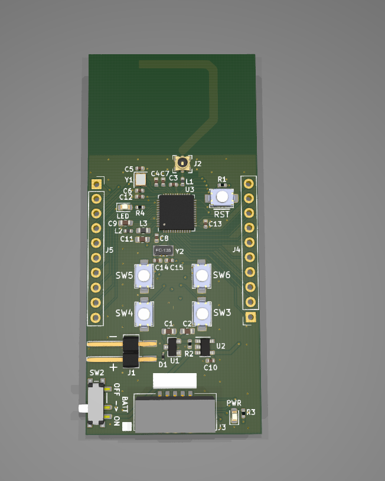
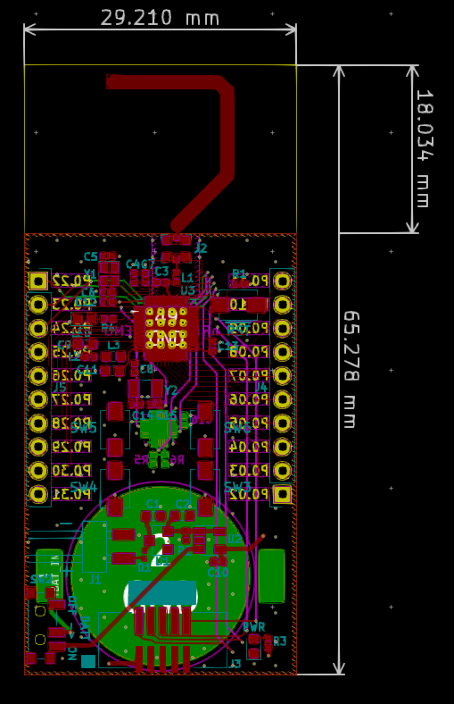

# nRF52832 Demo Board

### Summary: ###
  4 layer PCB based on Nordic's nRF52832 BLE chip. The antenna needs to be tuned with an exacto knife until
  the VSWR is as close to 1 at 2.4GHz - 2.45GHz as possible. The code to demonstrate that the antenna works 
  as well as the buttons and LEDs will be released shortly.

  The BOM, schematic PDF, and gerber files are all accessible in the _'Outputs/'_ folder. 
  Other project files are not included because they add clutter and can be generated from the project itself in KiCad.
  Thanks.
  
  
